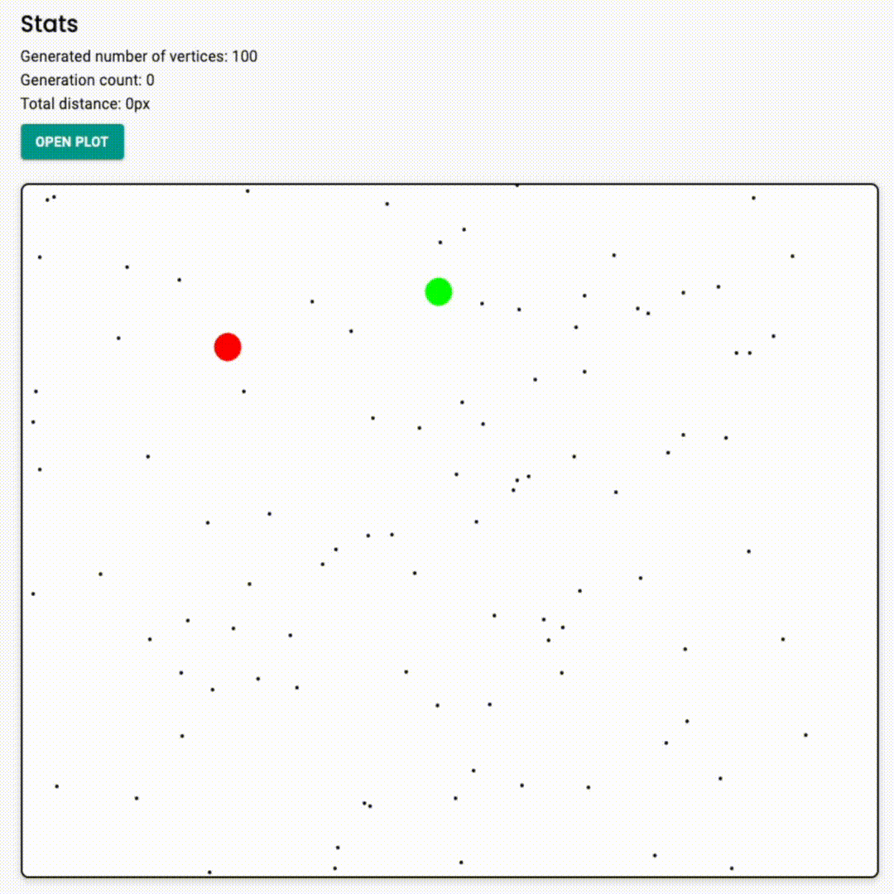

# Traveling Salesman Problem

## [Live Demo](https://6554c27723fb860e96e82e05--tangerine-faun-e81232.netlify.app/)

This is a web application which was designed with following main goals:

- Apply genetic algorithm to solve Traveling Salesman Problem
- Visualize solution process and generation building
- Provide a handful UI
- Examine different parameters of GA and their impact on performance
- Plot graphics to better understand the picture

## Algorithms implemented

Selections:

- Wheel Selection

Crossovers:

- Heuristic crossover
- Partially mapped crossover (PMX)
- Ordered crossover (OX)

Mutations:

- Swap
- Displacement

Local improvements:

- Two optimum
- Three optimum

## Demonstration



## Interface

### Main screen


### Plots


## Run locally

1. Clone this repo
2. Install dependencies

```
npm install
```

3. Run program

```
npm run dev
```

4. Go to localhost:3000

## Run test suite

```
npm test
```
